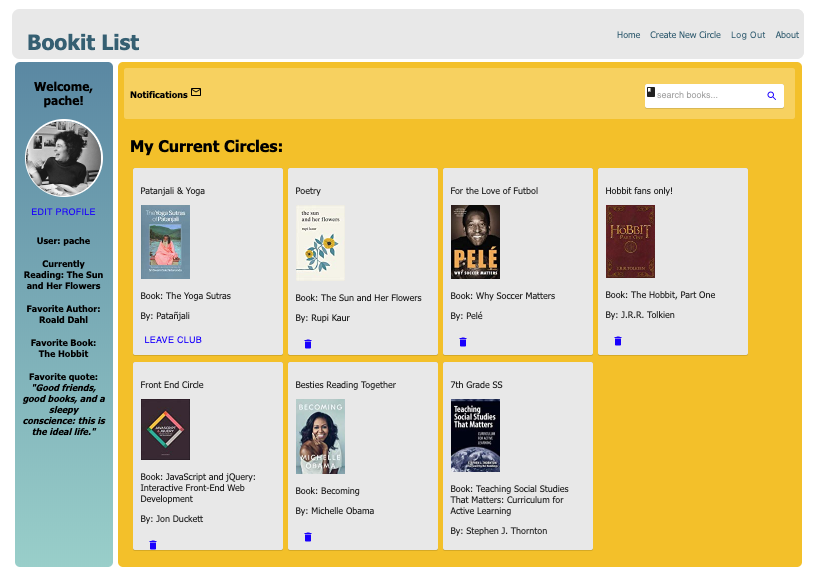

# Bookit List
Bookit List is an application designed for bookworms and learners alike. It is a desktop application that connects users to one another based on their current reads or want-to-reads.  Users are able to create reading circles specifically for a book and invite friends to join the circle in a few clicks; leaving more time for crumpets, tea, and talk. Bookit List also makes it a breeze to share, grow, and exchange ideas about your most favorite topics with others.

# Built With
- Javascript
- React
- Node.js
- Express
- Redux/Saga
- PostgreSQL
- Material UI
- [Good Reads API](https://www.goodreads.com/api)
- a full list of dependencies can be found in `package.json`

# Getting Started
These instructions will get you a copy of the project up and running on your local machine.

## Prerequisites
Before you get started, be sure to have the following software installed on your computer:
- [Node.js](https://nodejs.org/en/)
- [Nodemon](https://nodemon.io/)
- [PostrgeSQL](https://www.postgresql.org/)
- HomeBrew or equivalent

## Installing
1. Download this project.
2. `npm install`
3. Create a `.env` file at the root of the project and paste this line into the file:
    ```
    SERVER_SESSION_SECRET=superDuperSecret
    ```
    While you're in your new `.env` file, take the time to replace `superDuperSecret` with some long random string like `25POUbVtx6RKVNWszd9ERB9Bb6` to keep your application secure. Here's a site that can help you: [https://passwordsgenerator.net/](https://passwordsgenerator.net/). If you don't do this step, create a secret with less than eight characters, or leave it as `superDuperSecret`, you will get a warning.
4. Start postgres if not running already by using `brew services start postgresql`
5. Create a database called `woodbury` and follow instructions in database.sql file
5. `npm run client`
6. `npm run server`
7. Navigate to `localhost:3000`

## Good Reads API
1. Navigate to [Good Reads API](https://www.goodreads.com/api) to create an API_KEY.
2. Open the `.env` file and add the line: `API_KEY=` followed by your API KEY, with no spaces.

## Create database and table

Create a new database called `prime_app` and create a `user` table:

```SQL
CREATE TABLE "user" (
    "id" SERIAL PRIMARY KEY,
    "username" VARCHAR (80) UNIQUE NOT NULL,
    "password" VARCHAR (1000) NOT NULL
);
```
### Login Page


### Landing Page: Home Display of Current Reading Circles


### User Features


# Completed Features
- Search for books and capture data
- Create new circles and invite users to join
- Recieve in-app notifications of new invitations
- Accept and Decline invites to circles
- Post messages on a discussion board within each circle
- Edit existing circles

# Next Steps
- implement a user profile and image upload/avatar capablity
- implement email or text message ability 
- implement the ability to archive completed or deleted circles
- implement the ability to search books and link to more information
- implement a calendar


We **STRONGLY** recommend following these instructions carefully. It's a lot, and will take some time to set up, but your life will be much easier this way in the long run.

## Download (Don't Clone) This Repository

* Don't Fork or Clone. Instead, click the `Clone or Download` button and select `Download Zip`.
* Unzip the project and start with the code in that folder.
* Create a new GitHub project and push this code to the new repository.

## Prerequisites

Before you get started, make sure you have the following software installed on your computer:

- [Node.js](https://nodejs.org/en/)
- [PostgreSQL](https://www.postgresql.org/)
- [Nodemon](https://nodemon.io/)


If you would like to name your database something else, you will need to change `prime_app` to the name of your new database name in `server/modules/pool.js`

## Development Setup Instructions

* Run `npm install`
* Create a `.env` file at the root of the project and paste this line into the file:
    ```
    SERVER_SESSION_SECRET=superDuperSecret
    ```
    While you're in your new `.env` file, take the time to replace `superDuperSecret` with some long random string like `25POUbVtx6RKVNWszd9ERB9Bb6` to keep your application secure. Here's a site that can help you: [https://passwordsgenerator.net/](https://passwordsgenerator.net/). If you don't do this step, create a secret with less than eight characters, or leave it as `superDuperSecret`, you will get a warning.
* Start postgres if not running already by using `brew services start postgresql`
* Run `npm run server`
* Run `npm run client`
* Navigate to `localhost:3000`

## Debugging

To debug, you will need to run the client-side separately from the server. Start the client by running the command `npm run client`. Start the debugging server by selecting the Debug button.


Then make sure `Launch Program` is selected from the dropdown, then click the green play arrow.


## Lay of the Land

* `src/` contains the React application
* `public/` contains static assets for the client-side
* `build/` after you build the project, contains the transpiled code from `src/` and `public/` that will be viewed on the production site
* `server/` contains the Express App

## Deployment

1. Create a new Heroku project
1. Link the Heroku project to the project GitHub Repo
1. Create an Heroku Postgres database
1. Connect to the Heroku Postgres database from Postico
1. Create the necessary tables
1. Add an environment variable for `SERVER_SESSION_SECRET` with a nice random string for security
1. In the deploy section, select manual deploy

# Author
Pache Vang


## Acknowledgments

* Prime Digital Academy for Authentication and Middleware code

